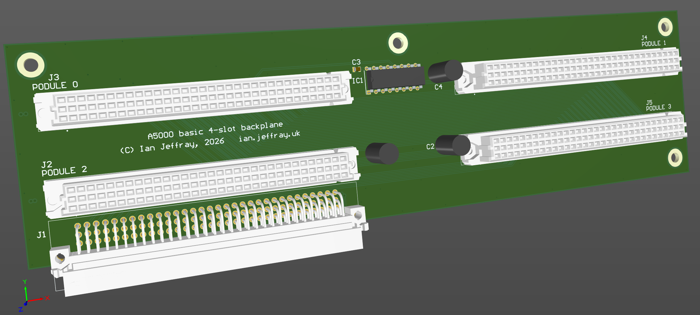

# Acorn A5000 four-slot basic backplane

March 2026

This is my implementation of a four-slot backplane for Acorn A5000 series machines.  I call this a "basic" backplane because it doesn't have the "Unix" PALs for interrupt decoding / masking.  These are not required/used by RISC OS anyway.

## Licence

No warranty is provided, and this work is used at your own risk.  

Licenced as CC BY-SA 4.0

Copyright 2026 Ian Jeffray

